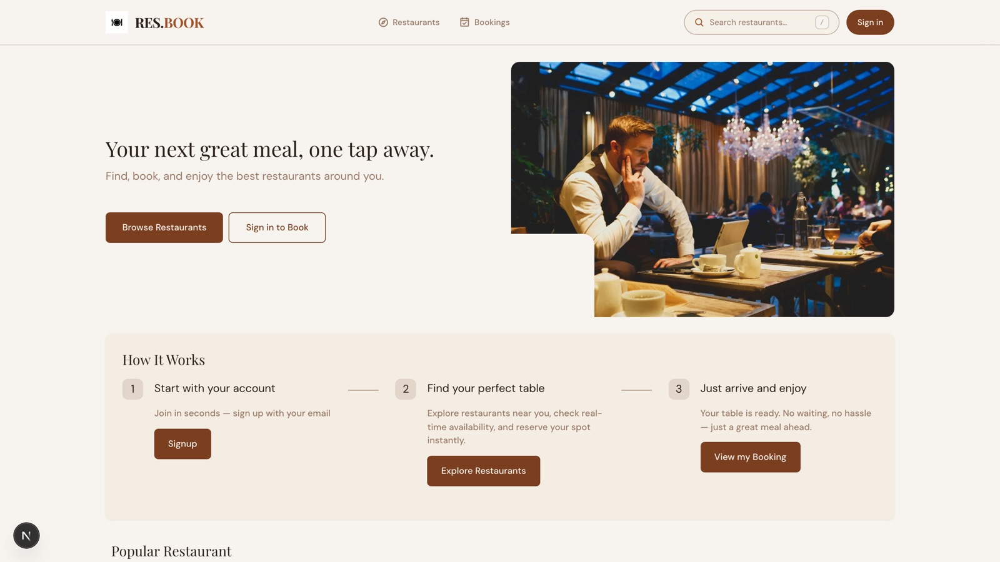

# restaurant-booking-next-app



A full-stack **restaurant table-booking + owner CRM** application. Customers
browse restaurants and book tables; owners manage their restaurants, staff,
tables, photos, bookings, payments, and reviews; managers and staff run the
day-to-day operations (manager role drives the operations dashboard, staff role
is the front-of-house/ops workforce).

Built with the Next.js App Router, TypeScript, **Drizzle ORM**, and **Supabase**
(Postgres + object storage). Runtime data lives in a PostgreSQL database
accessed through Drizzle; the `app/_data/dummy/*.json` files are used **only** by
the seed script to populate that database and are never read at runtime.

---

## How it started

The project was bootstrapped with
[`create-next-app`](https://nextjs.org/docs/app/api-reference/cli/create-next-app).
For a long time the entire runtime data layer ran on **stub JSON files** under
`app/_data/dummy/*.json` (users, owners, officers, restaurants, tables, hours,
photos, bookings, payments, reviews, categories, OTP tokens). Every auth,
profile, booking, and dashboard module read and wrote those files directly.

That worked for scaffolding but meant:

- nothing actually persisted (resets on redeploy, impossible to share),
- seeded "accounts" were never really loginable (the passwords in the dummy
  JSON were placeholder bcrypt strings),
- any multi-user interaction (two browsers, a real owner + a real customer)
  was impossible,
- every feature silently owned the whole file and file lock fights were real.

## How it's flowed

The data layer was migrated off the dummy JSON and onto a real database in
three phases, keeping `tsc` and `lint` green at every step:

1. **Auth + profiles + avatars** — account lookup, sign-in/sign-up, session,
   OTP tokens, and customer profile reads/writes moved to Drizzle queries
   against Supabase Postgres. Avatars moved to Supabase object storage.
2. **Bookings core + customer actions** — creating, listing, confirming,
   cancelling, paying, and reviewing bookings now run as Drizzle inserts and
   transactions (no more direct `bookings.json`/`payments.json` writes).
3. **Owner/CRM dashboard** — the full owner-side CRM (restaurants, tables,
   staff hire/fire, officer roles, photos, reviews, analytics, booking ops)
   now uses Drizzle everywhere, and the last JSON "profile patch" helpers were
   removed from runtime code.

Today the only place the dummy JSON is touched is `app/_db/seed.ts`, which
truncates and re-inserts the `app/_data/dummy/*.json` contents into the
database. There is **no mail client** configured in this repo, so the OTP
"send" step is a no-op and email verification is **bypassed in demo mode** (see
below).

## Tech stack

- **Framework** — Next.js 15 (App Router, Server Components, Server Actions)
- **Language** — TypeScript
- **ORM** — Drizzle ORM
- **Database** — Supabase Postgres (postgres-js driver, `drizzle-orm/postgres-js`)
- **Storage** — Supabase object storage (restaurant photos + avatars)
- **Auth** — custom sessions + bcrypt password hashing (no external auth SDKs)
- **Validation** — Zod
- **Styling** — Tailwind CSS + shadcn-style Radix components

## Repository layout

| Path                         | Purpose                                                    |
| ---------------------------- | ---------------------------------------------------------- |
| `app/_db/`                   | Drizzle schema, client, and the database seed script       |
| `app/_data/dummy/`           | Seed-source JSON (read only by `app/_db/seed.ts`)          |
| `app/_data/auth/`            | Auth: users, sessions, password, OTP tokens                |
| `app/_data/profiles/`        | Customer profile + avatar (Supabase) data                  |
| `app/_data/bookings/`        | Bookings + payments core (Drizzle)                         |
| `app/_data/dashboard/`       | Owner/CRM data (Drizzle)                                   |
| `app/_data/storage/`         | Supabase storage (restaurant photos, avatars)              |
| `app/_libs/`                 | Shared runtime libraries (password, session, OTP…)         |
| `app/(default)/`             | Customer-facing routes (sign-in, sign-up, OTP, booking)    |
| `app/(owner)/`               | Owner + manager/staff CRM dashboard                        |

## Getting started

### 1. Install

```bash
pnpm install
```

### 2. Environment

Create `.env.local` (see `.env.local.example`):

```bash
DATABASE_URL="postgresql://...pooler.supabase.co:5432/postgres?sslmode=require"   # Supabase connection string
SUPABASE_URL="https://xxxx.supabase.co"
SUPABASE_SERVICE_ROLE_KEY="..."  # service-role key for storage/admin
```

### 3. Push schema + seed the database

```bash
pnpm db:push    # push the Drizzle schema to Supabase
pnpm db:seed    # truncate + re-insert dummy JSON into Postgres
```

## Demo accounts (demo mode)

All seeded users share the **same demo password**:

```
Password: Password123!
```

And email verification is **bypassed** in demo mode (see "OTP in demo mode"
below) — you can type **any number** into the OTP box and it will be accepted.

| Role    | Email                                    | Example user          | What you can do                               |
| ------- | ---------------------------------------- | --------------------- | --------------------------------------------- |
| Customer | `alice.johnson@gmail.com`                | Alice Johnson         | Browse, book, pay, review                      |
| Customer | `ben.nguyen@outlook.com`                 | Ben Nguyen            | Alternate customer                            |
| Customer | `clara.smith@yahoo.com`                  | Clara Smith           | Alternate customer                            |
| Owner   | `hiroshi.tanaka@sakuragarden.jp`         | Hiroshi Tanaka        | Full CRM for Sakura Garden                     |
| Owner   | `priya.sharma@thespiceroute.in`          | Priya Sharma          | Full CRM for The Spice Route                   |
| Owner   | `marco.ferrari@labellaitalia.it`         | Marco Ferrari         | Full CRM for La Bella Italia                   |
| Manager | `kenji.watanabe@sakuragarden.jp`         | Kenji Watanabe        | Manager dashboard (Sakura Garden)              |
| Manager | `rajesh.kumar@thespiceroute.in`          | Rajesh Kumar          | Manager dashboard (The Spice Route)            |
| Staff   | `yuki.nakamura@sakuragarden.jp`          | Yuki Nakamura         | Staff front-of-house (Sakura Garden)           |
| Staff   | `anjali.mehta@thespiceroute.in`          | Anjali Mehta          | Staff front-of-house (The Spice Route)         |

**Customers** sign in and book tables → redirect to `/signup/role` → pick
customer → land in the customer dashboard.

**Owners** sign in and go straight to `/owner` (the full CRM).

**Officers (manager / staff)** are employees of a restaurant; owners hire them
from the dashboard, and they sign in with the same email + password.

## OTP in demo mode

There is **no mail client** in this repo Holiday (no SMTP/SendGrid/Resend
configured), so the "send the code" step cannot send real email. Because of
that, email verification in this demo **accepts any entered code**:

- In `app/_data/auth/otp.ts`, `verifyEmailOtp` currently returns `true` for any
  input, stamping the email as verified so sign-up continues. The strict
  OTP-check block is preserved in the same file as commented code.

To **re-enable strict verification + real email delivery**:

1. Open `app/_data/auth/otp.ts` → `verifyEmailOtp`.
2. Un-comment the strict block (the real `db` lookup + code check against the
   `otp_tokens` table) and delete/comment the `return true;` bypass.
3. Re-add the mailer: in `issueEmailVerificationOtp`, replace the
   `console.log("[auth] … OTP for …")` line with a real mail client call
   (e.g. Resend / SendGrid / AWS SES) that sends the `code` to `email`.
4. Optionally delete the `server-only` dev log. Then every seeded user must
   enter the real code that was sent.

(If you want a strict check but no real mailer, you can keep the
`console.log` "dev: no mail client" line and just un-comment the strict
verification block — the code is printed to the server console instead of
being emailed.)

## Scripts

| Command         | Purpose                                              |
| --------------- | ---------------------------------------------------- |
| `pnpm dev`      | Start the dev server                                 |
| `pnpm build`    | Production build                                     |
| `pnpm lint`     | ESLint                                               |
| `pnpm exec tsc --noEmit` | Type-check (no --noEmit script exists) |
| `pnpm db:push`  | Push Drizzle schema to Supabase                      |
| `pnpm db:seed`  | Truncate + seed the DB from `app/_data/dummy/`       |
| `pnpm db:studio`| Open Drizzle Studio                                  |

> The seed script truncates all tables first. It is safe to run repeatedly.

## Data model

- `users` — one row per account (id, username, email, password hash, role,
  verify timestamps, allergics, avatar).
- `customers` / `owners` / `officers` — role-specific extensions keyed by
  `userId` (owner business license, officer position + restaurant).
- `restaurants` / `tables` / `restaurant_hours` / `restaurant_photos` —
  restaurants, their tables, hours, and photo storage URLs.
- `bookings` / `payments` / `reviews` — customer bookings, linked payments, and
  reviews with owner replies.
- `otp_tokens` — email-verification / reset / two-factor tokens (currently
  written at seed + issued at runtime, strict check bypassed in demo).

Seeded counts (from the latest `pnpm db:seed` run): 46 users (13 customers,
27 owners, 6 officers), 12 categories, 27 restaurants, 93 tables, 189 hours,
226 photos, 122 bookings, 75 payments, 32 reviews, 5 OTP tokens.

## License / notes

Demo project. Not intended for production multi-tenant use; the OTP bypass and
single shared demo password exist purely so seeded accounts are actually
usable without a mail provider.
